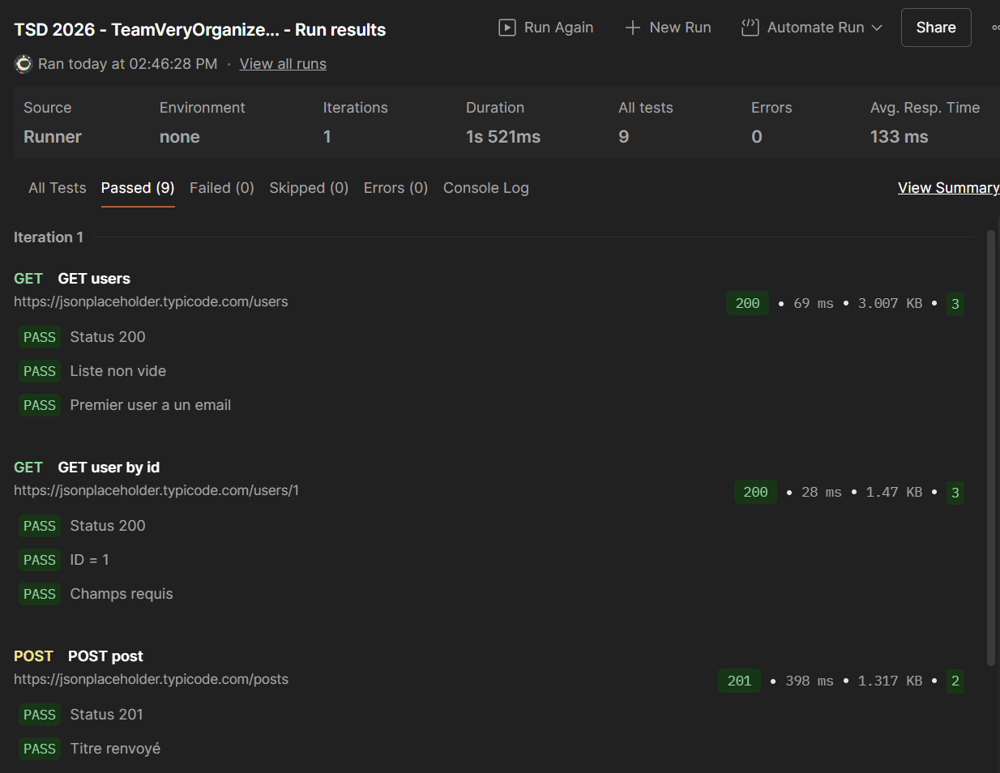

# Lab 6 - API Testing Report

## Collection
Name: TSD 2026 - TeamVeryOrganized - API Tests
File: automation/postman/team-very-organized-apitests.postman_collection.json

## Requests (>= 4, GET + POST, positive + negative)
| # | Method | Endpoint | Type | Assertions |
|---|---|---|---|---|
| 1 | GET | /users | positive | 200, non-empty, has email |
| 2 | GET | /users/1 | positive | 200, id==1, fields |
| 3 | POST | /posts | positive | 201, title echoed |
| 4 | GET | /users/999999 | negative | error status |

## Collection Runner result

